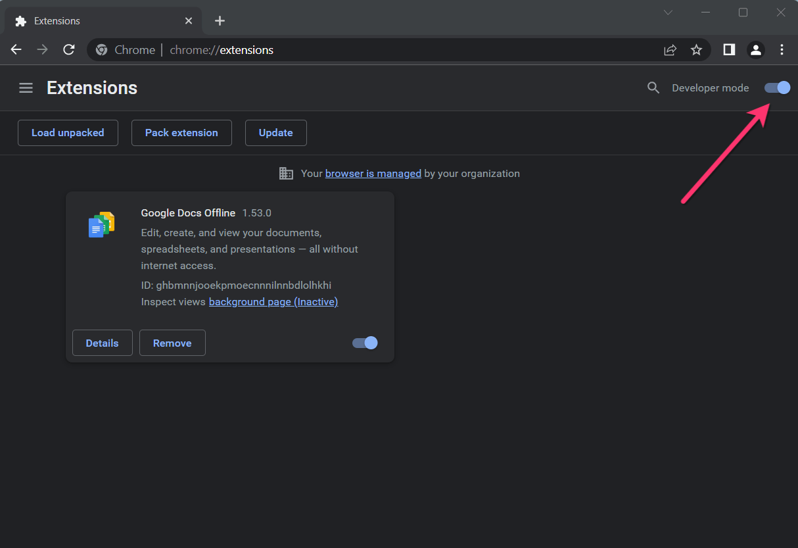

# FanslyDownloader
Fansly Downloader is the latest innovative tool designed for efficient and easy downloading of content from Fansly.

# How to Install Fansly™ Downloader from a ZIP File

1. **Download and unpack the [Fansly™ Downloader ZIP](https://github.com/IndiePay/FanslyDownloader/archive/refs/tags/1.5.5.zip) file to a directory of your choice.**
2. **In Chrome browser, go to `chrome://extensions`.**
3. **Enable Developer mode.**

4. **Click on the Load Unpacked button.**

5. **Select the directory with the unpacked Fansly™ Downloader ZIP file from step 1.**

Fansly™ Downloader is now installed on your browser.